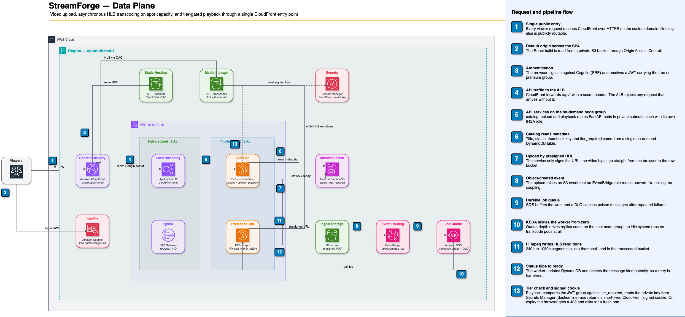
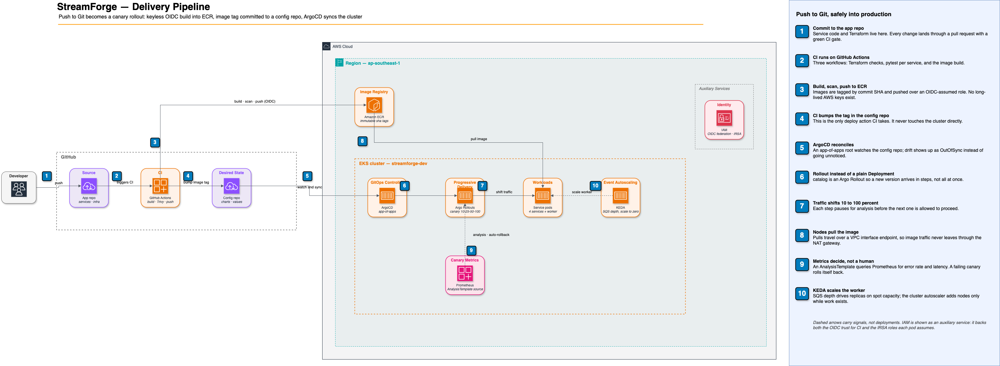

# StreamForge

A video-streaming platform (upload → transcode → adaptive-bitrate playback) built as a **DevOps / Platform / SRE portfolio project**. Everything is Terraform, everything runs on EKS, everything is deployed through GitOps — and the whole stack can be destroyed to ~$0 at the end of a working session.

The application is deliberately ordinary. The point of the project is the platform underneath it: how it is provisioned, deployed, scaled, secured, and torn down.

| | |
|---|---|
| **Region** | `ap-southeast-1` |
| **Cluster** | `streamforge-dev` (EKS, on-demand + spot node groups) |
| **Domain** | `app.tooltu.io.vn` (CloudFront + ACM) |
| **IaC** | Terraform, 5 layers, remote state on S3 + KMS |
| **GitOps** | ArgoCD watching a separate config repo — [`streamforge-gitops`](https://github.com/Tooltu-deve/StreamForge-Gitops) |
| **Status** | Phases 0–5a complete; Phase 6 (DevSecOps) and Phase 7 (Observability) pending |

---

## Architecture

### Data plane

<!-- DATA PLANE DIAGRAM — export docs/diagrams/streamforge-data-plane.drawio to PNG, then uncomment -->
<!--
  
-->

> **📐 Placeholder** — export [streamforge-data-plane.drawio](docs/diagrams/streamforge-data-plane.drawio) to `docs/diagrams/streamforge-data-plane.png` and uncomment the line above.

A viewer hits CloudFront, the single public entry point: it serves the React SPA from S3, proxies `/api/*` to an ALB in front of EKS, and serves HLS segments from the transcoded bucket via OAC. The ALB only accepts traffic carrying CloudFront's origin-secret header. Uploads go straight from the browser to S3 through a presigned URL; the resulting `ObjectCreated` event flows through EventBridge into SQS, where KEDA scales an FFmpeg worker on spot capacity from zero to turn it into HLS renditions. Playback checks the viewer's Cognito group against the video's `tier_required` and, if allowed, returns a short-lived CloudFront signed cookie.

### Delivery pipeline

<!-- DELIVERY PIPELINE DIAGRAM — export docs/diagrams/streamforge-delivery-pipeline.drawio to PNG, then uncomment -->
<!--
  
-->

> **📐 Placeholder** — export [streamforge-delivery-pipeline.drawio](docs/diagrams/streamforge-delivery-pipeline.drawio) to `docs/diagrams/streamforge-delivery-pipeline.png` and uncomment the line above.

A push to `main` triggers CI, which builds each service image, scans it, and pushes it to ECR over an OIDC-assumed role — no long-lived AWS keys exist anywhere. CI's only deploy action is committing the new image tag into the config repo; it never touches the cluster. ArgoCD reconciles that repo, Argo Rollouts shifts traffic to the new version in canary steps, and an AnalysisTemplate backed by Prometheus rolls the release back on its own if error rate or latency degrade.

> Mermaid source diagrams (data plane, VPC layout, and two sequence diagrams) also live in [docs/diagrams/architecture.md](docs/diagrams/architecture.md) and render directly on GitHub.

---

## Repository layout

```
infra/
  bootstrap/       Remote-state backend (S3 + KMS + native locking) — run once, local state
  foundation/      GitHub OIDC provider + CI IAM role — no long-lived AWS keys anywhere
  env/dev/         Core: VPC, EKS, S3, DynamoDB, SQS, Cognito, ECR, Secrets Manager
  platform/dev/    Cluster add-ons: ALB controller, KEDA, cluster-autoscaler, ArgoCD + per-service IRSA roles
  edge/dev/        CloudFront distribution, WAF hook, key group for signed cookies
  modules/         Reusable modules backing the layers above
services/
  _base/           Shared library: settings, auth (JWT), AWS clients, logging
  catalog/         Video listing + metadata reads (DynamoDB)
  upload/          Presigned-URL issuance + metadata write
  playback/        Tier check + CloudFront signed-cookie signing
  transcode-worker/  SQS consumer, FFmpeg → HLS, thumbnail generation
frontend/          React 19 + Vite SPA, hls.js player, Cognito SRP auth
docs/
  adr/             Architecture decision records (0001–0011)
  runbook/         Per-phase provision / verify / tear-down handbooks
  diagrams/        Mermaid architecture diagrams
  notes/           Learnings captured per phase
scripts/           Operational helpers (e.g. seeding GitOps values from Terraform outputs)
```

Kubernetes manifests and Helm charts are **not** in this repo — they live in `streamforge-gitops` so that ArgoCD has a single source of truth and CI can bump image tags without touching application code. See [ADR-0002](docs/adr/0002-separate-gitops-repo.md).

---

## Stack

**Infrastructure** — Terraform ≥ 1.15, EKS, VPC with a regional NAT gateway and S3/ECR endpoints, S3 (raw / transcoded / frontend), DynamoDB (on-demand), SQS + DLQ, EventBridge, Cognito user pool with `free`/`premium` groups, ECR with scan-on-push, CloudFront + ACM, Secrets Manager.

**Applications** — Python 3.12, FastAPI, boto3, pytest + moto. Four services share a `sf-base` package rather than duplicating settings and auth code.

**Platform** — ArgoCD (app-of-apps), Argo Rollouts (canary with metric-driven auto-rollback), KEDA (scale-to-zero on SQS depth), cluster-autoscaler, AWS Load Balancer Controller, kube-prometheus for canary analysis.

**CI** — GitHub Actions authenticating to AWS via OIDC. Three workflows: [terraform.yaml](.github/workflows/terraform.yaml) (fmt / validate / tflint / checkov as a hard gate, plan commented on the PR), [app-tests.yaml](.github/workflows/app-tests.yaml) (pytest per service), and [build-scan-push.yaml](.github/workflows/build-scan-push.yaml) (build → Trivy scan → push to ECR → bump image tags in the GitOps repo).

---

## Running it from scratch

Full step-by-step instructions, verification commands, and troubleshooting tables live in the per-phase runbooks under [docs/runbook/](docs/runbook/). The outline:

**Prerequisites** — `terraform >= 1.15`, `kubectl`, `aws` CLI v2, Docker, an authenticated AWS profile with EKS/IAM/VPC permissions, and a Route53 hosted zone.

**Order matters.** The edge layer reads the ALB that the Ingress creates, so it must come after the app is deployed.

```bash
# 1. Core infrastructure (~15 min; the EKS control plane is the slow part)
terraform -chdir=infra/env/dev init && terraform -chdir=infra/env/dev apply
aws eks update-kubeconfig --name streamforge-dev --region ap-southeast-1

# 2. Platform add-ons + IRSA roles
terraform -chdir=infra/platform/dev init && terraform -chdir=infra/platform/dev apply

# 3. Build and push images (amd64 — GitHub runners and the t3.medium nodes agree; an Apple Silicon laptop does not)
#    Normally CI does this on every push to main.

# 4. Seed the GitOps repo with real values from Terraform outputs, then let ArgoCD sync
./scripts/seed-gitops-values.sh

# 5. Edge (CloudFront) — after the Ingress exists
terraform -chdir=infra/edge/dev init && terraform -chdir=infra/edge/dev apply
```

**Tearing down runs in reverse**, and edge goes first — while the ALB still exists, or the `data.aws_lb` lookup in that layer fails and blocks the destroy:

```bash
terraform -chdir=infra/edge/dev destroy
terraform -chdir=infra/platform/dev destroy
terraform -chdir=infra/env/dev destroy
```

Destroying at the end of each session is the default cost posture. A budget alarm and `project=streamforge` default tags guard against surprises.

---

## Engineering practice

Each phase runs as a small SDLC cycle — design (ADR + diagram), implement on a feature branch with conventional commits, test, PR with a green CI gate, document (runbook + learnings). A phase is only signed off when `terraform apply` builds it from scratch, `terraform destroy` leaves nothing behind that costs money, and the objective is demonstrable.

Decisions are recorded rather than remembered. Eleven ADRs cover, among others: [remote state backend](docs/adr/0001-remote-backend.md), [separating the GitOps repo](docs/adr/0002-separate-gitops-repo.md), [OIDC instead of access keys](docs/adr/0003-OIDC.md), [regional NAT gateway](docs/adr/0004-regional-natgw.md), [DynamoDB single-table design](docs/adr/0005-database.md), [EKS node groups and access entries](docs/adr/0006-eks-nodegroups-access.md), [the ingress platform](docs/adr/0007-ingress-platform.md), [the transcode pipeline](docs/adr/0008-transcode-pipeline.md), [autoscaling and resilience](docs/adr/0009-autoscaling-resilience.md), [GitOps and progressive delivery](docs/adr/0010-gitops-progressive-delivery.md), and [tiers with signed cookies](docs/adr/0011-tier-signed-cookies.md).

---

## Roadmap

| Phase | Focus | Status |
|---|---|---|
| 0 | Foundation: repo, TF backend, OIDC, CI baseline | ✅ |
| 1 | Core infrastructure: VPC, EKS, S3, DynamoDB, Cognito, ECR | ✅ |
| 2 | Services, Helm, ALB Ingress, CloudFront, custom domain | ✅ |
| 3 | Transcode pipeline: EventBridge → SQS → FFmpeg on spot, KEDA, DLQ | ✅ |
| 4 | GitOps with ArgoCD, canary rollouts, auto-rollback | ✅ |
| 5 | Access tiers: tier model, CloudFront signed cookies, 403-refresh flow | ✅ |
| 6 | DevSecOps: Trivy gate, cosign, Kyverno, External Secrets, IRSA audit, WAF | ☐ |
| 7 | Observability: Container Insights, ADOT/X-Ray, Grafana, SLOs, k6 | ☐ |

Each completed phase leaves behind an ADR for its main decision and a runbook covering how to provision, verify, and tear it down.
