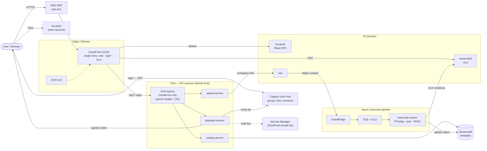
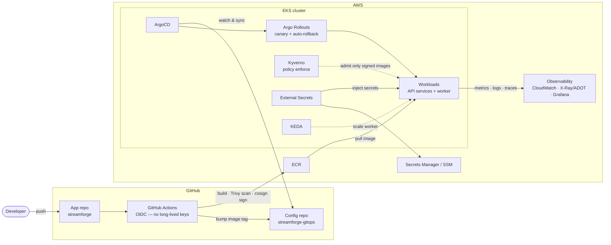
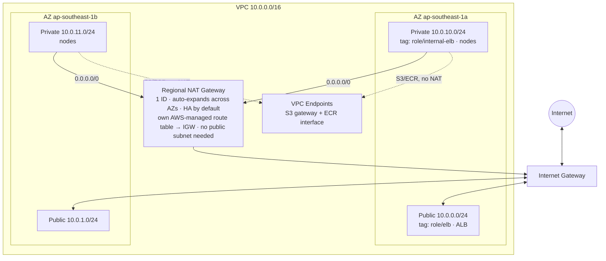
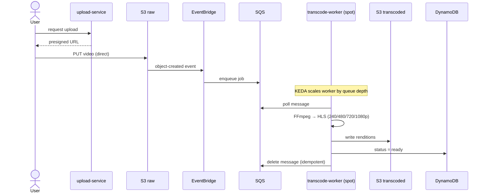
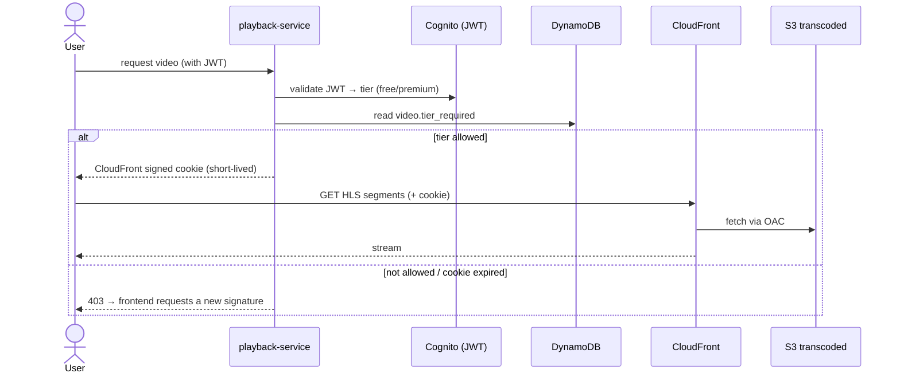

# StreamForge — Architecture Diagrams

> Source of truth for the system design. Diagrams are written in Mermaid so they render on GitHub and stay diffable in Git. Grounded in the design doc §3.
>
> ⚠️ Route53 hosted zone lives in a **separate AWS account** (cross-account, currently deferred). GitOps manifests live in a **separate repo** `streamforge-gitops` (ADR-0002).

---

## 1. Data plane (user-facing flows)

**Legend:** solid = synchronous request; dotted = supporting/secret access; the pipeline (EventBridge→SQS→Worker) is **asynchronous**. All public inbound traffic enters through **AWS WAF → CloudFront**; the ALB accepts traffic **only from CloudFront** (origin secret header verified at the ALB + security-group scoping).

---

## 2. Platform plane (GitOps, CI/CD, DevSecOps, observability)

---

## 3. VPC / network layout

**Notes:** EKS nodes (on-demand + spot) sit in **private** subnets; the internet-facing ALB in **public** subnets. Subnet tags are required for the AWS Load Balancer Controller and EKS auto-discovery. Egress uses a **Regional NAT Gateway** (GA Nov 2025): a single NAT ID that auto-expands/contracts across AZs by workload presence, giving **HA by default** with **zonal affinity** (no forced cross-AZ egress) and higher IP/port limits (32 IPs/AZ). It is a standalone resource with its own AWS-managed route table to the IGW, so **no public subnet is needed to host it**; private subnets in every AZ route `0.0.0.0/0` to the same regional NAT ID. Use **automatic mode** (AWS manages IPs + AZ expansion). VPC endpoints (S3/ECR) still bypass NAT to cut cost. *(Regional NAT does not support private NAT — not needed here.)*

---

## 4. Sequence — upload → transcode (async)

---

## 5. Sequence — playback with tier check (signed cookie)

